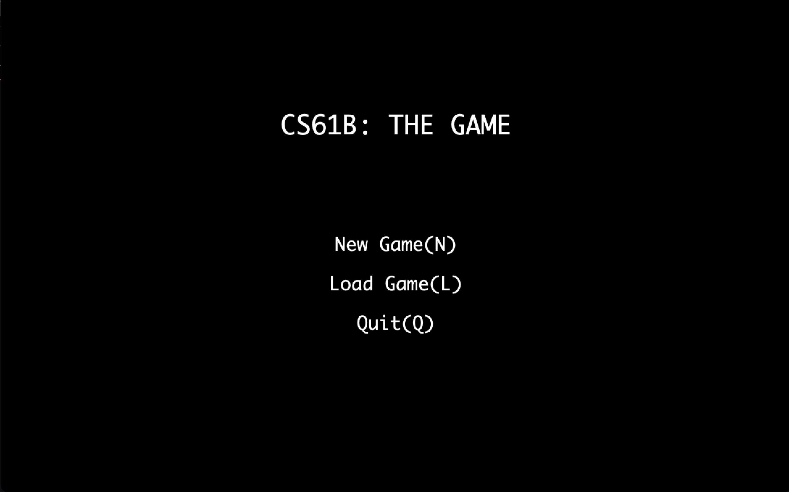
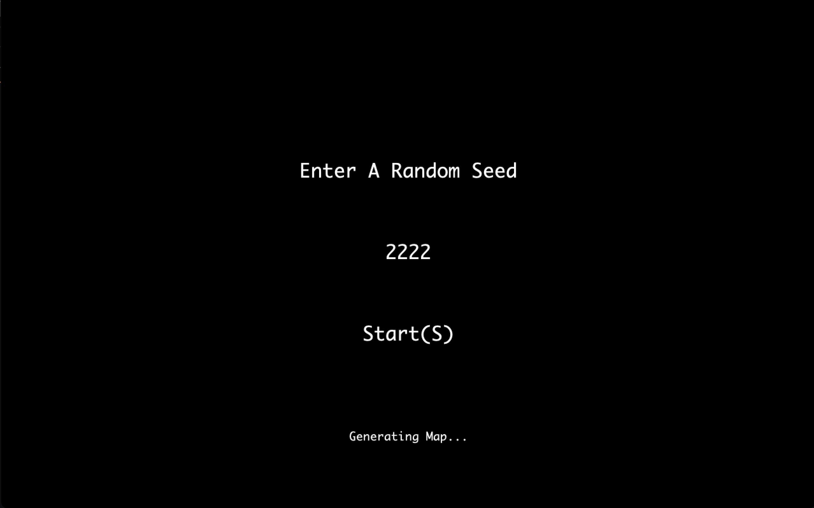

# BYOW

## Overview
A 2D tile-based world exploration engine developed with Java StdLib. This is a project from the esteemed CS61B course at UC Berkley, which I learned online and implemented this project independently.

## What I Learned
For the dynamic creation of randomized maps, I devised a rudimentary procedural dungeon generation algorithm that utilizes minimum spanning tree.

## Screenshot
### Startup menu

Users can:
- Press N to start a new game.
- Press L to load saved progress.
- Press Q to quit game.

### Enter seed and generate map
After pressing N on the keyboard for “new world”, the user should be prompted to enter a “random seed”, which is a long value of their choosing. This long data type is used to generate the world randomly.

### Randomly generated map
Here is a screenshot of some randomly generated map from game.

